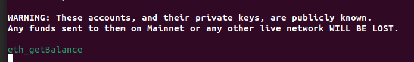

# Pear Wallet

This project is a personally developed wallet application and is not intended for commercial use. Its primary purpose is to consolidate knowledge and learn about blockchain technology and cryptocurrencies.

## **Getting Started**

To start building or running the application, you need to have **Wails** and **Go** installed on your system. Follow the [official Wails documentation](https://wails.io/docs/gettingstarted/installation) for installation instructions.

Once Wails is installed, run the following command in your terminal to check for any missing dependencies:  
```bash
wails doctor
```
## Build and Run

To build the application you can run the following command at the wallet folder level: 

```bash
wails build -clean && ./build/bin/wallet
```

To work with the Hardhat network, you need to run the Hardhat node in a separate terminal. Instructions for this process can be found in the README inside the Hardhat folder.


You can run the application in development mode with the following command:
```bash
wails dev
```


The operation will be registered by hardhat's node console:

